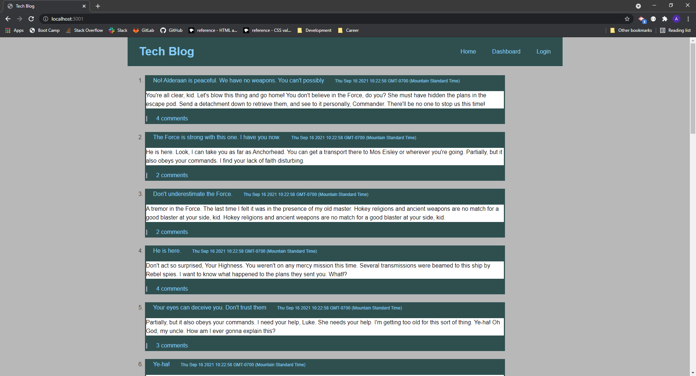

# Tech Blog 

## Description 

**Model-View-Controller (MVC) Challenge: Tech Blog**

**Challenge Elements**\
Your challenge this week is to build a CMS-style blog site similar to a Wordpress site, 
where developers can publish their blog posts and comment on other developers’ posts as well. 
You’ll build this site completely from scratch and deploy it to Heroku. Your app will follow 
the MVC paradigm in its architectural structure, using Handlebars.js as the templating 
language, Sequelize as the ORM, and the express-session npm package for authentication.

## Installation

Application deployed at live URL.

-The link to the live URL: https://afternoon-chamber-70504.herokuapp.com/
-The projects code can be accessed at:https://github.com/AWiebe2021/Tech-Blog

## Screenshot

## Credits
Solo project
